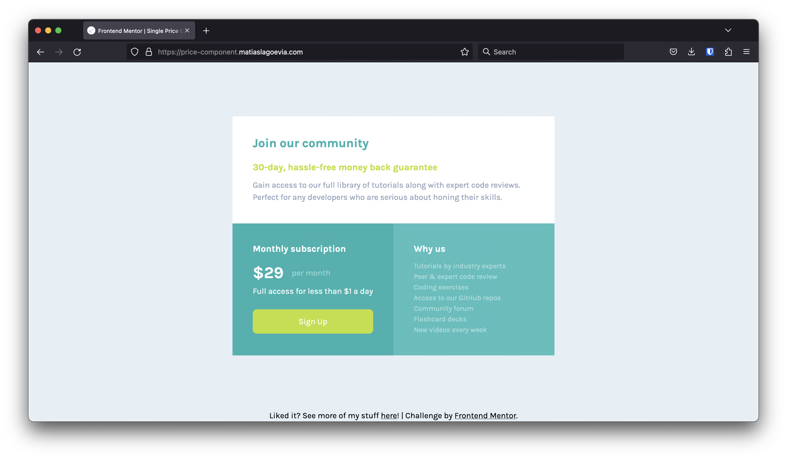

# Frontend Mentor - Single price grid component solution

This is a solution to the [Single price grid component challenge on Frontend Mentor](https://www.frontendmentor.io/challenges/single-price-grid-component-5ce41129d0ff452fec5abbbc). Frontend Mentor challenges help you improve your coding skills by building realistic projects.

## Table of contents

- [Overview](#overview)
  - [The challenge](#the-challenge)
  - [Screenshot](#screenshot)
  - [Links](#links)
- [My process](#my-process)
  - [Built with](#built-with)
  - [What I learned](#what-i-learned)
  - [Continued development](#continued-development)
  - [Useful resources](#useful-resources)
- [Author](#author)

## Overview

### The challenge

Users should be able to:

- View the optimal layout for the component depending on their device's screen size
- See a hover state on desktop for the Sign Up call-to-action

### Screenshot

### Links

- Solution URL: [https://www.frontendmentor.io/solutions/responsive-price-component-using-css-grid-and-flexbox-gcFeeFjFqN](https://www.frontendmentor.io/solutions/responsive-price-component-using-css-grid-and-flexbox-gcFeeFjFqN)

- Live Site URL: [https://price-component.matiaslagoevia.com](https://price-component.matiaslagoevia.com)

## My process

### Built with

- Flexbox
- CSS Grid
- Mobile-first workflow

### What I learned

**Code Reuse with a Template.**

I noticed that for the past challenges, I was reusing a lot of the same initial content ideas. I created [fet](https://github.com/matiaslagoevia/fet) and started this challenge from that started code, and will do the same for future ones!

**Using `CSS Grid`.**

My first feeling was to go and complete this challenge using only flexbox, but I decided to go against that and learn more about grids.

- I use `grid-template-areas` with identifier values to specify how I want to organize the grid. Then, I use `grid-area` on each of the areas to associate them to the template.
- I use `grid-template-columns` to specify that I want both columns to take the same amount of space (thanks to StackOverflow! :)) — no need for the `*-rows` equivalent at this time.

**Mobile-first workflow & media queries.**

This is the first challenge that I use both of these and I'm very happy how they turned out.

- I implemented the design with a mobile layout first through the Firefox web tools, simulating a screen size similar to that on the Figma spec
- I added a media query to specify a different `grid-template-areas` (non-vertical stacking of the bottom columns) for screen sizes larger than 600px — I was happy with this value after testing

**Having the sign-up button's padding match the available width.**

This was difficult initially, but I realized that I could just make it's parent (`.sign-up`) be a flex column container and that way have the desired effect.

### Continued development

It was great to see my current and former efforts pay off to arrive to this solution — I feel that I am getting more confident and able to identify issues and solutions faster.

I'd like to continue to work on the following:

- **CSS Grid**: this is a topic I've scratched a bit but I feel there's much more to learn, so I look forward to doing so in later challenges and with some of the supplementary content/references/etc.
- **CSS Preprocessors**: I'd originally planned to use one here, but decided against it — I think I'd find more use in them in larger challenges where I can take advantage of some of their features, and I think I'd prefer to run into those hurdles they solve first to understand the motivation behind them and knowing when they're most applicable.
- **Naming schemes/organization**: Same as preprocessors above, I feel this isn't so impactful for simpler projects, but for larger ones I'd like to experiment with different ways/approaches of organization and naming — one I've heard of so far is [BEM](https://getbem.com/).

### Useful resources

- [Conquering Responsive Layouts](https://courses.kevinpowell.co/conquering-responsive-layouts) - This has been amazing to get in a good mindset of how to make things responsively easily and not in a convoluted way. Being able to look at a design and mentally "break it up" to know how to approach working on it and getting it done.
- [MDN — Grid](https://developer.mozilla.org/en-US/docs/Web/CSS/grid) - MDN continues to be a great resource for anything web development related. This helped me get some of the intuition behind grid's and arrive at `grid-template-areas` solution.
- [Stack Overflow Answer](https://stackoverflow.com/a/61240964) — this detailed answer helped me understand how to have both columns take up the same space.

## Author

- Website - [matiaslagoevia.com](https://matiaslagoevia.com)
- Frontend Mentor - [@matiaslagoevia](https://www.frontendmentor.io/profile/matiaslagoevia)
